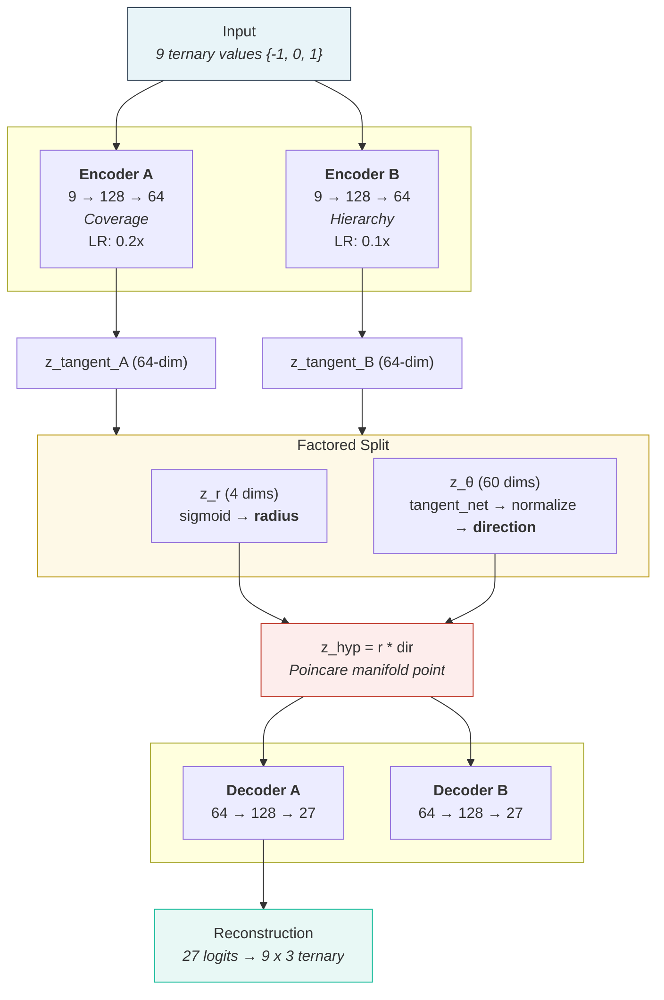

# 3-Adic ML

[](https://www.python.org/downloads/)
[](https://pytorch.org/)
[](LICENSE)
[](tests/)

**Deep learning training pipelines and mathematical foundations for p-adic variational autoencoders.**

Train dual VAEs whose latent spaces live in a Poincare ball, with radial position determined by 3-adic valuation and direction determined by digit prefix structure. Hierarchy emerges from geometry, not memorization.

## Results (V7.2)

| Metric | Value | Description |
|--------|-------|-------------|
| **Q** | 2.163 | Composite quality (dist_corr + 1.5 * hierarchy) |
| **ARI** | 0.844 | Direction clustering vs digit prefix classes (v=0) |
| **Coverage** | 0.997 | Per-digit reconstruction accuracy |
| **Hierarchy** | -0.95 | Spearman correlation (valuation vs radius) |

> Trained on RTX 3050 6GB. Float64 throughout for numerical stability near the Poincare boundary.

## Architecture

**Dual VAE + Factored Hyperbolic Geometry + LR Controller (V7.2)**



### Core Components

| Component | Structure | Purpose |
|-----------|-----------|---------|
| **VAE-A** | Encoder 9->128->64, Decoder 64->128->27 | Coverage (reconstruction) |
| **VAE-B** | Same structure, independent weights | Hierarchy learning |
| **Factored Projection** | z_r -> radius, z_θ -> direction, z_hyp = r * dir | Gradient-isolated hyperbolic mapping |
| **LR Controller** | MetricBasedLR with Q-gated thresholds | Dynamic LR scale control |
| **AngularCoherenceLoss** | Per-level prefix-class direction loss | Direction geometry sharpening |

### What Makes It "P-Adic"

1. **Data**: All 19,683 ternary operations (3^9) with values {-1, 0, 1}
2. **3-adic valuation**: v_3(n) measures divisibility by powers of 3
3. **Geometric encoding**: High valuation -> near origin, low valuation -> near boundary
4. **Loss alignment**: Poincare distances aligned to 3-adic valuations (ultrametric -> hyperbolic)
5. **Direction geometry**: Digit prefix classes spontaneously emerge in z_θ (ARI=0.844 at v=0)
6. **Per-level prefix tuning**: `level_prefix_k` gives deeper prefix splits at v=1/v=2; soft-margin `target_sim` preserves diversity

## Installation

```bash
git clone https://github.com/gesttaltt/3-adic-ml.git
cd 3-adic-ml
python -m venv venv && source venv/bin/activate
pip install -r requirements.txt
```

> **Requirements**: Python 3.10+, PyTorch 2.0+, CUDA GPU (tested on RTX 3050 6GB). All dependencies (including tensorboard, scikit-learn, matplotlib, umap-learn) are in `requirements.txt`. See `docs/DEPENDENCIES.md` for details.

## Usage

### Training

```bash
# V7.2 large architecture (recommended)
python src/train.py --config src/presets/v7_large.yaml

# V7.1 standard (latent_dim=32)
python src/train.py --config src/presets/v7.yaml

# V6 legacy (non-factored expmap0 mode)
python src/train.py --config src/presets/v6.yaml
```

<details>
<summary><b>CLI Options</b></summary>

| Option | Description |
|--------|-------------|
| `--config PATH` | Path to YAML config file (required) |
| `--seed N` | Random seed (default: 42) |
| `--device cuda/cpu` | Training device (default: cuda) |
| `--validate-only` | Validate config and exit |
| `--force` | Continue even if validation fails |
| `--amp` | Use automatic mixed precision |
| `--name NAME` | Custom run name |

</details>

### Monitoring

```bash
tensorboard --logdir runs/
```

Key TensorBoard scalars:

| Scalar | What it tracks |
|--------|---------------|
| `Q` | Composite quality: dist_corr + 1.5 * \|hierarchy\| |
| `Coverage` | Per-digit reconstruction accuracy |
| `Hierarchy/A` | Spearman correlation (valuation vs radius) |
| `Direction/AQ` | Angular coherence (intra - inter level sim) |
| `Direction/ARI_prefix3` | K-means vs digit prefix ARI at v=0 (live) |
| `LRController/*` | Per-component learning rate multipliers |

## Project Structure

```
src/
├── core/           # 3-adic algebra (TernarySpace singleton)
├── geometry/       # Hyperbolic operations (Poincare ball via geoopt)
├── losses/         # Training objectives (config-driven composition)
├── models/         # VAE architectures (encoder/decoder/projection)
├── config/         # Constants, paths, StateNetConfig
├── presets/        # YAML experiment configurations
├── utils/          # Checkpoints, TensorBoard, hardware monitoring
└── train.py        # Training entry point (includes hierarchy metrics)
```

<details>
<summary><b>Key Files</b></summary>

| File | Purpose |
|------|---------|
| `src/models/vae.py` | TernaryVAEV6, TernaryVAEV6Controllable, EncoderHead |
| `src/models/lr_controller.py` | MetricBasedLR, TrainingMetrics, LR scale control |
| `src/models/hyperbolic_projection.py` | expmap0/logmap0 projections |
| `src/config/statenet_config.py` | StateNetConfig dataclass |
| `src/geometry/poincare.py` | Riemannian backend (geoopt) |
| `src/core/ternary.py` | Immutable 3-adic field logic |
| `src/losses/combined.py` | Config-driven loss composition |

</details>

## Configuration

Training uses YAML configuration files. See `src/presets/v7_large.yaml` for the current recommended config.

<details>
<summary><b>Key Configuration Sections (V7.2)</b></summary>

```yaml
# Model architecture (factored latent)
model:
  name: TernaryVAEV6Controllable
  latent_dim: 64       # z_r (4 dims) + z_θ (60 dims)
  hidden_dim: 128
  factored: true       # V7: split z_tangent into radial + direction
  radial_dims: 4
  init_identity: true
  tangent_scale: 0.1

# Training parameters
training:
  epochs: 800
  batch_size: 4096
  lr: 8.0e-4

# Loss functions (config-driven, 11 available)
loss:
  rich_hierarchy:
    enabled: true
    hierarchy_weight: 5.0
  angular_coherence:
    enabled: true
    weight: 1.0
    level_prefix_k: [3, 4, 5, 0, 0, 0, 0, 0, 0, 0]  # Per-level prefix depth
    target_sim: [1.0, 0.85, 0.70, 0, 0, 0, 0, 0, 0, 0]  # Soft-margin targets (v=0 MUST be 1.0)
    n_pairs: 3000  # ~1000 per active level

# LR Controller (differential learning rates)
option_c:
  enabled: true
  encoder_a_lr_scale: 0.2
  encoder_b_lr_scale: 0.1
  projections_lr_scale: 1.0
```

</details>

## Mathematical Background

<details>
<summary><b>3-Adic Valuation</b></summary>

The 3-adic valuation v_3(n) is the largest k such that 3^k divides n:

| n | v_3(n) | Interpretation |
|---|--------|----------------|
| 1, 2, 4, 5, 7, 8 | 0 | Not divisible by 3 |
| 3, 6, 12, 15 | 1 | Divisible by 3 |
| 9, 18, 36 | 2 | Divisible by 9 |
| 27, 54 | 3 | Divisible by 27 |
| 0 | 9 | Convention (infinity) |

</details>

<details>
<summary><b>Hierarchy Encoding</b></summary>

Operations with high valuation map to small radii (near Poincare ball origin):
- v=0 -> radius ~ 0.85 (boundary)
- v=9 -> radius ~ 0.10 (origin)

This creates a natural hierarchical structure where "more fundamental" operations (higher valuation) are geometrically central.

</details>

### Active Loss Functions (V7.2)

| Loss | Weight | Purpose |
|------|--------|---------|
| **RichHierarchyLoss** | 5.0 | Unified hierarchy + coverage + separation |
| **PAdicGeodesicLoss** | 2.0 | Poincare distance alignment to 3-adic metric |
| **RadialHierarchyLoss** | 1.0 | Direct radius enforcement per valuation |
| **MonotonicRadialLoss** | 1.0 | Per-level ordering constraints |
| **AngularCoherenceLoss** | 1.0 | Direction clustering by digit prefix (V7) |
| **HyperbolicKLDivergence** | 0.01 | KL divergence in Poincare ball |

> Full list of all 11 loss classes: see [docs/SPECS.md](docs/SPECS.md)

## Documentation

| Document | Contents |
|----------|----------|
| [`CLAUDE.md`](CLAUDE.md) | Detailed architecture documentation (V6.2 base + V7 extensions) |
| [`docs/FAQ.md`](docs/FAQ.md) | Frequently asked questions |
| [`docs/SPECS.md`](docs/SPECS.md) | Technical specifications and engineering constraints |
| [`src/README.md`](src/README.md) | Module documentation and integration guide |
| [`docs/audits/`](docs/audits/) | Codebase audit reports (chronological) |

## Related Projects

| Repository | Focus |
|------------|-------|
| **[3-adic-ml](https://github.com/gesttaltt/3-adic-ml)** (this repo) | VAE architectures, hyperbolic geometry, training pipelines |
| **[ultrametric-antigen-AI](https://github.com/Ai-Whisperers/ultrametric-antigen-AI)** | Bioinformatics application: antigen/protein/codon analysis using trained models from this repo |

## Hardware Requirements

- **GPU**: NVIDIA RTX 3050 (6GB VRAM) or better
- **RAM**: 16GB minimum
- **Storage**: ~100MB for checkpoints

The pipeline includes automatic OOM handling, emergency checkpoint saving, and GPU/RAM monitoring via `HardwareMonitor`.

## License

This project is licensed under the MIT License. See [LICENSE](LICENSE) for details.

## Contributing

1. Fork the repository and create a feature branch
2. Ensure all tests pass: `pytest tests/ -v`
3. Follow existing code patterns (float64 throughout, geoopt for geometry)
4. Submit a pull request with a clear description of changes

## Changelog

| Date | Version | Key Changes |
|------|---------|-------------|
| 2026-03-23 | V7.2+ | `level_prefix_k` per-level prefix depth, soft-margin `target_sim`, live ARI in training loop, `target_sim[0]=0.90` regression identified and fixed to 1.0, repo moved to `gesttaltt/3-adic-ml` |
| 2026-03-22 | V7.2 | Identity geometry audit, 4-run ARI comparison (0.721->0.844), Q=2.163 ceiling analysis |
| 2026-03-21 | V7.1 | AngularCoherenceLoss + AQ metric, tangent_scale collapse fix |
| 2026-03-19 | V6.2 | Sampling fix (sqrt-inverse weighting), loss weight rebalancing, dist_corr root cause analysis |
| 2026-03-11 | V6.2 | Critical bug fixes (VAE-B dead, max_radius saturation, config key mismatch, KL wiring) |
| 2026-01-26 | V6.0 | True hyperbolic geometry (expmap0/logmap0), learnable loss weights, codebase review |

## Acknowledgments

This work builds on:
- [geoopt](https://github.com/geoopt/geoopt) - Riemannian optimization in PyTorch
- Theoretical foundations from p-adic analysis and hyperbolic geometry
