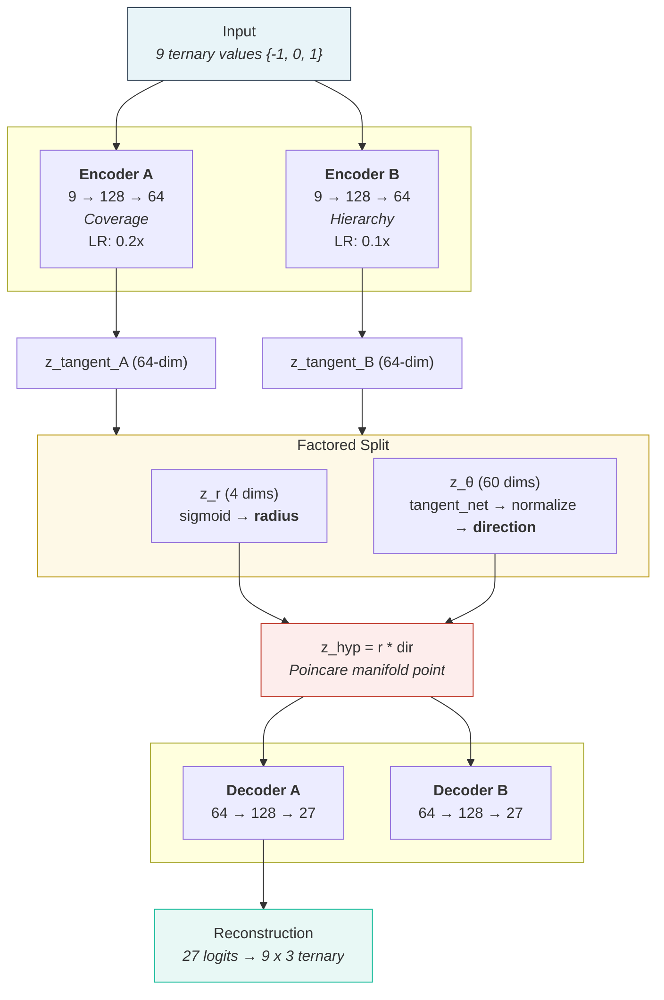

# 3-Adic ML

[](https://www.python.org/downloads/)
[](https://pytorch.org/)
[](LICENSE)
[](tests/)

**Deep learning training pipelines and mathematical foundations for p-adic variational autoencoders.**

Train dual VAEs whose latent spaces live in a Poincare ball, with radial position determined by 3-adic valuation and direction determined by digit prefix structure. Hierarchy emerges from geometry, not memorization.

## Results (V7.2)

| Metric | Value | Description |
|--------|-------|-------------|
| **Q** | 2.163 | Composite quality (dist_corr + 1.5 * hierarchy) |
| **ARI** | 0.844 | Direction clustering vs digit prefix classes (v=0) |
| **Coverage** | 0.997 | Per-digit reconstruction accuracy |
| **Hierarchy** | -0.95 | Spearman correlation (valuation vs radius) |

> Trained on RTX 3050 6GB. Float64 throughout for numerical stability near the Poincare boundary.

## Architecture

**Dual VAE + Factored Hyperbolic Geometry + LR Controller (V7.2)**



### Core Components

| Component | Structure | Purpose |
|-----------|-----------|---------|
| **VAE-A** | Encoder 9->128->64, Decoder 64->128->27 | Coverage (reconstruction) |
| **VAE-B** | Same structure, independent weights | Hierarchy learning |
| **Factored Projection** | z_r -> radius, z_θ -> direction, z_hyp = r * dir | Gradient-isolated hyperbolic mapping |
| **LR Controller** | MetricBasedLR with Q-gated thresholds | Dynamic LR scale control |
| **AngularCoherenceLoss** | Per-level prefix-class direction loss | Direction geometry sharpening |

### What Makes It "P-Adic"

1. **Data**: All 19,683 ternary operations (3^9) with values {-1, 0, 1}
2. **3-adic valuation**: v_3(n) measures divisibility by powers of 3
3. **Geometric encoding**: High valuation -> near origin, low valuation -> near boundary
4. **Loss alignment**: Poincare distances aligned to 3-adic valuations (ultrametric -> hyperbolic)
5. **Direction geometry**: Digit prefix classes spontaneously emerge in z_θ (ARI=0.844 at v=0)
6. **Per-level prefix tuning**: `level_prefix_k` gives deeper prefix splits at v=1/v=2; soft-margin `target_sim` preserves diversity

## Installation

```bash
git clone https://github.com/gesttaltt/3-adic-ml.git
cd 3-adic-ml
python -m venv venv && source venv/bin/activate
pip install -r requirements.txt
```

> **Requirements**: Python 3.10+, PyTorch 2.0+, CUDA GPU (tested on RTX 3050 6GB). All dependencies (including tensorboard, scikit-learn, matplotlib, umap-learn) are in `requirements.txt`. See `docs/DEPENDENCIES.md` for details.

## Usage

### Training

```bash
# V7.2 large architecture (recommended)
python src/train.py --config src/presets/v7_large.yaml

# V7.1 standard (latent_dim=32)
python src/train.py --config src/presets/v7.yaml

# V6 legacy (non-factored expmap0 mode)
python src/train.py --config src/presets/v6.yaml
```

<details>
<summary><b>CLI Options</b></summary>

| Option | Description |
|--------|-------------|
| `--config PATH` | Path to YAML config file (required) |
| `--seed N` | Random seed (default: 42) |
| `--device cuda/cpu` | Training device (default: cuda) |
| `--validate-only` | Validate config and exit |
| `--force` | Continue even if validation fails |
| `--amp` | Use automatic mixed precision |
| `--name NAME` | Custom run name |

</details>

### Monitoring

```bash
tensorboard --logdir runs/
```

Key TensorBoard scalars:

| Scalar | What it tracks |
|--------|---------------|
| `Q` | Composite quality: dist_corr + 1.5 * \|hierarchy\| |
| `Coverage` | Per-digit reconstruction accuracy |
| `Hierarchy/A` | Spearman correlation (valuation vs radius) |
| `Direction/AQ` | Angular coherence (intra - inter level sim) |
| `Direction/ARI_prefix3` | K-means vs digit prefix ARI at v=0 (live) |
| `Topology/betti_0` | Persistent homology H0 (connected components) |
| `LRController/*` | Per-component learning rate multipliers |

### Visualization Pipeline

The `VisualizationPipeline` generates interactive HTML visualizations using **precomputed hyperbolic distance matrices** (not Euclidean coordinates). Runs automatically during training eval.

```bash
# Outputs saved to runs/visualizations/<run_name>/
ls runs/visualizations/v7_large/epoch_050_*.html
```

| Algorithm | What it shows | Hyperbolic integration |
|-----------|--------------|----------------------|
| **UMAP** | 2D/3D manifold layout | Precomputed Poincare distance matrix |
| **PaCMAP** | Balanced local/global structure | Hyperbolic kNN injected via `pair_neighbors` |
| **TriMAP** | Triplet-based embedding | Precomputed distance matrix |
| **Poincare PCA** | Tangent-space PCA (radius-preserving) | logmap0 -> PCA projection |
| **Persistent homology** | Topological signature (Betti numbers) | ripser on hyperbolic distance matrix |

Configure in YAML:
```yaml
visualization:
  max_per_level: 500     # Stratified subsample cap per valuation level
  persist_every: 50      # Generate HTML every N epochs
  html_dir: runs/visualizations/v7_large
  save_html: true
```

## Project Structure

```
src/
├── core/           # 3-adic algebra (TernarySpace singleton)
├── geometry/       # Hyperbolic operations (Poincare ball via geoopt)
├── losses/         # Training objectives (config-driven composition)
├── models/         # VAE architectures (encoder/decoder/projection)
├── config/         # Constants, paths, StateNetConfig
├── presets/        # YAML experiment configurations
├── utils/          # Checkpoints, TensorBoard, hardware monitoring, visualization pipeline
└── train.py        # Training entry point (includes hierarchy metrics)
```

<details>
<summary><b>Key Files</b></summary>

| File | Purpose |
|------|---------|
| `src/models/vae.py` | TernaryVAEV6, TernaryVAEV6Controllable, EncoderHead |
| `src/models/lr_controller.py` | MetricBasedLR, TrainingMetrics, LR scale control |
| `src/models/hyperbolic_projection.py` | expmap0/logmap0 projections |
| `src/config/statenet_config.py" | StateNetConfig dataclass |
| `src/geometry/poincare.py` | Riemannian backend (geoopt) |
| `src/core/ternary.py` | Immutable 3-adic field logic |
| `src/losses/combined.py` | Config-driven loss composition |

</details>

---

## The P-Adic Ecosystem

This repository is part of a tri-fold ecosystem exploring the intersection of $p$-adic mathematics, ternary logic, and high-performance computing:

*   **[3-Adic ML](https://github.com/gesttaltt/3-adic-ml)**: (This Repo) Mathematical foundation and framework for $p$-adic Variational Autoencoders and geometric deep learning.
*   **[3-Adic Bioinformatics](https://github.com/gesttaltt/3-adic-bioinformatics)**: Application of ultrametric geometry to genomic sequences, protein folding, and biological hierarchy analysis.
*   **[Ternary Engine](https://github.com/gesttaltt/ternary-engine)**: High-performance C++/C backend for native ternary arithmetic and efficient $p$-adic valuation processing.

## Status & Engagement

**Current Phase**: Active Low-Profile Research (V10.0 Algebraic Consistency)

We are committed to the scientific validation of "Meaning = Geometry." While the code is now public to facilitate peer review and academic collaboration, we are maintaining a cautious and focused development pace. 

*   **Proposals**: We are not actively seeking investment, acquisition, or commercial partnerships at this time. Our priority is technical integrity and core research.
*   **Contributions**: We welcome code contributions, bug reports, and mathematical critiques from the niche community of $p$-adic and geometric ML researchers.
*   **Limitations**: This software is experimental. The `ternary-engine` requires specific C++ environments, and V10 training is ongoing.
